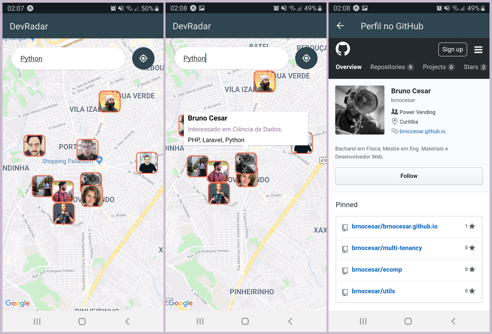
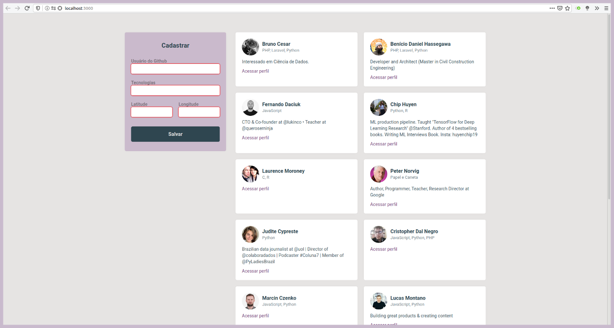

# dev-radar

As "semanas gratuitas" da [Rocketseat](https://rocketseat.com.br/) são eventos onlines que ocorrem cerca de três ou quatro vezes ao ano e são realizados ao longo de uma semana. São compostos por aulas, _lives_ e espaços mediados para discussões, principalmente sobre carreiras de Tecnologia. 

O destaque do evento é o curso focado na _stack_ JavaScript em que uma aplicação funcional é desenvolvida do zero. Nessa aplicação é utilizado o NodeJS para contruir o _back_, React para a versão _web_ e React Native para a _mobile_.

## :globe_with_meridians: Edição #10 - DevRadar

Na edição **#10** foi desenvolvida uma aplicação em que pessoas Desenvolvedoras podem se cadastrar e ser encontradas de acordo com as tecnologias que usam. 

O cadastro é feito através da versão _web_ e devem ser passados: o _username_ do GitHub, as tecnologias pelas quais quer ser buscada e as coordenadas geográficas da posição em que deseja "_spawnar_". Além disso, a versão _web_ apresenta a listagem de todas as pessoas cadastradas.

Na versão _mobile_ é possível realizar buscas por pessoas através de alguma tecnologia, e assim, todas as pessoas cadastradas com essa tecnologia e que estão em um raio de 5 Km serão apresentadas no mapa. Para ter mais informações sobre uma pessoa encontrada no mapa, basta selecioná-la e será possível acessar o perfil do GitHub pelo navegador embutido.

A imagem e descrição das pessoas cadastradas são obtidas através da API do GitHub.

  
 Telas da versão mobile (<strong>Clique</strong> para revelar)

  

    
  

  
 Versão web (<strong>Clique</strong> para revelar)

  

    
  

 
<a href='#top'>Voltar ao topo</a>
 
