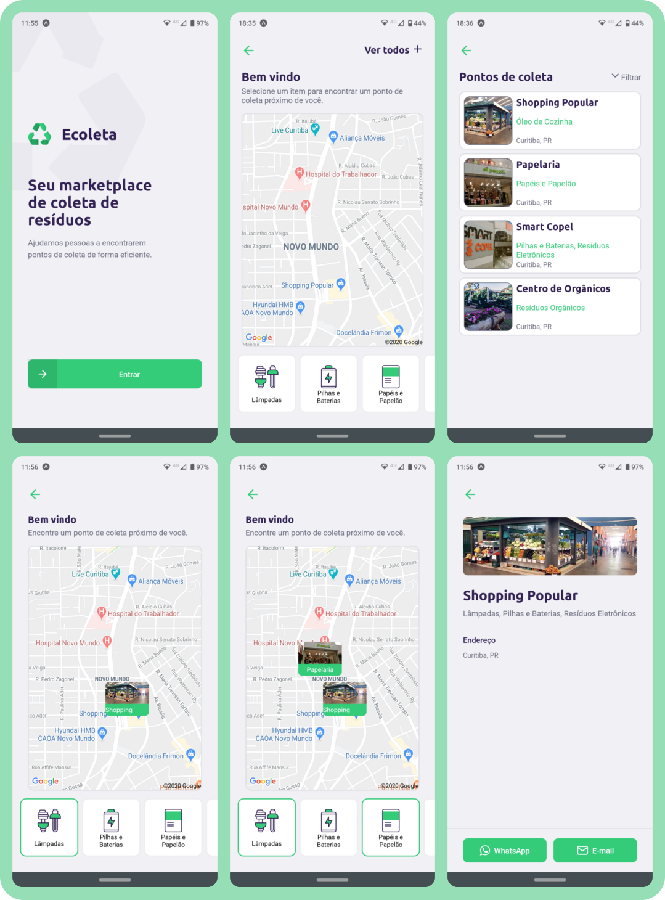

# omnistack-rocketseat
As "semanas gratuitas" da [Rocketseat](https://rocketseat.com.br/) são eventos onlines que ocorrem cerca de três ou quatro vezes ao ano e são realizados ao longo de uma semana. São compostos por aulas, _lives_ e espaços mediados para discussões, principalmente sobre carreiras de Tecnologia. 

O destaque do evento é o curso focado na _stack_ JavaScript em que uma aplicação funcional é desenvolvida do zero. Nessa aplicação é utilizado o NodeJS para contruir o _back_, React para a versão _web_ e React Native para a _mobile_.

#### Projetos desenvolvidos  
- <a href='#10'>Edição #10 - DevRadar</a>
- <a href='#12'>Edição #12 - Ecoleta</a>

## Edição #10 - DevRadar

Na edição **#10** foi desenvolvida uma aplicação em que pessoas Desenvolvedoras podem se cadastrar e ser encontradas de acordo com as tecnologias que usam. 

O cadastro é feito através da versão _web_ e devem ser passados: o _username_ do GitHub, as tecnologias pelas quais quer ser buscada e as coordenadas geográficas da posição em que deseja "_spawnar_". Além disso, a versão _web_ apresenta a listagem de todas as pessoas cadastradas.

Na versão _mobile_ é possível realizar buscas por pessoas através de alguma tecnologia, e assim, todas as pessoas cadastradas com essa tecnologia e que estão em um raio de 5 Km serão apresentadas no mapa. Para ter mais informações sobre uma pessoa encontrada no mapa, basta selecioná-la e será possível acessar o perfil do GitHub pelo navegador embutido.

A imagem e descrição das pessoas cadastradas são obtidas através da API do GitHub.

  
 Telas da versão mobile (<strong>Clique</strong> para revelar)

  

    
  

  
 Versão web (<strong>Clique</strong> para revelar)

  

    
  

 
<a href='#top'>Voltar ao topo</a>
 

## Edição #12 - Ecoleta
Nesta edição a aplicação é um marketplace para conectar locais especializados em coletar resíduos e pessoas que querem descartá-los de forma adequada.

### :gear: _back-end_
É uma API que atende as versões _web_ e _mobile_. (...)

### :desktop_computer: _Web_
A maior parte das funcionalidades está disponível na versão _web_, nela é possível: 

  
:pencil: Cadastrar um Ponto de coleta (<strong>Clique</strong> para revelar a página)

  

    
  

  
:notebook: Acessar a lista de todos os Pontos de coletas cadastrados e filtrá-los por Estado e Cidade (<strong>Clique</strong> para revelar a página)

  

    
  

  
:bookmark_tabs: Acessar a página de detalhes de um Ponto de coleta (<strong>Clique</strong> para revelar a página)

  

    
  

### :iphone: _Mobile_
A versão _mobile_ permite buscar Pontos de coleta de acordo com a posição geográfica do usuário, abaixo é possível ver as telas da aplicação _mobile_:

  
<strong>Clique aqui</strong> para ver as telas da versão <i>mobile</i>

  

    
  

